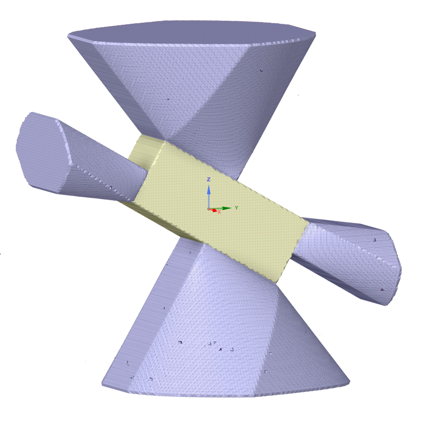

# c-sharp-derivatives

Dependencies:
* C# 6.0
* GradientSpace v4 (g4)

```
dotnet build
dotnet run --project .\LatticeRobotCS\
```

The only implicit class used at the moment is "ImplicitFromCode", which also provides a derivative with respect to its A axis of rotation, `rotateADeriv`.  An overload of the value callback provides this derivative.  

To output a mesh of the `rotateADeriv`, see `ImplicitFromCode.RotatedLattice(Vector3d p)`.  

